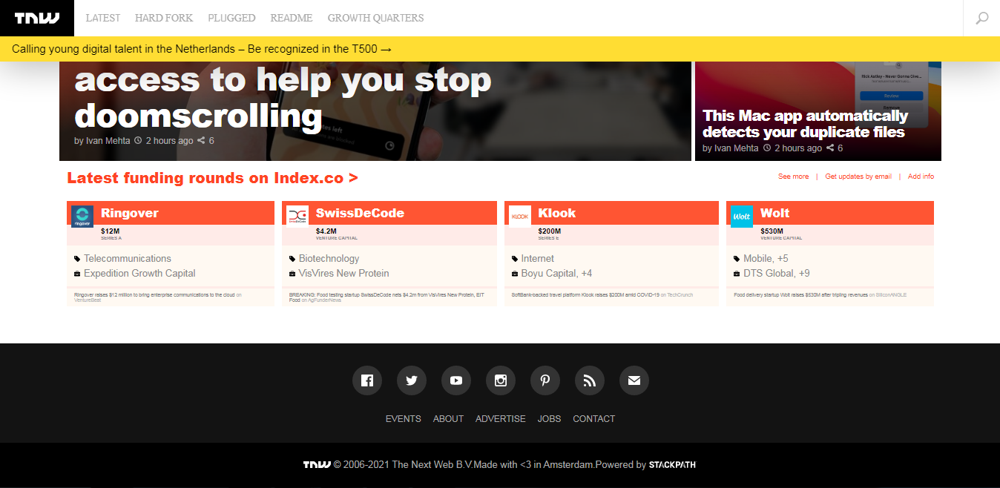

# TNW Responsive Homepage Clone

> A Responsive Clone of the TNW Homepage.


| *A screenshop of the First version of the webpage clone.*

## Built With

- Languages: _**HTML, CSS**_
- Frameworks: _**N/A**_
- Technologies used: _**Git, GitHub**_
- Features: _**Responsive**_

## Live Demo

- [Live Demo Link](https://mrramoun.github.io/TNW-Website-Clone)

## Local Copy

To get a local copy up and running follow these simple example steps.

### Prerequisites

- browser (e.g: chrome).

### Setup

- Open the terminal (cmd for windows users).
- Clone the repo to your local machine.
    ```bash
    git clone https://github.com/MrRamoun/TNW-Website-Clone.git
    ```
- Open the repo directory
    ```bash
    cd TNW-Website-Clone
    ```
### Usage

- Open the `index.html` file in your browser of choice.


## Authors

👤 **Ramoun**

- GitHub: [@mrramoun](https://github.com/mrramoun)
- Twitter: [@ramoun16](https://twitter.com/ramoun16)
- LinkedIn: [@ramoun](https://www.linkedin.com/in/ramoun/)

👤 **Maximiliano**

- GitHub: [@githubhandle](https://github.com/githubhandle)
- Twitter: [@twitterhandle](https://twitter.com/twitterhandle)
- LinkedIn: [LinkedIn](https://linkedin.com/linkedinhandle)


👤 **Chibuike Uzoechina**

- GitHub: [@Chike1990](https://github.com/Chike1990)
- Twitter: [@ChibuikeUzoechi](https://twitter.com/@ChibuikeUzoechi)
- LinkedIn: [@chibuike-uzoechina](https://www.linkedin.com/in/chibuike-uzoechina-630857102)

## 🤝 Contributing

Contributions, issues, and feature requests are welcome!

Feel free to check the [issues page](https://github.com/MrRamoun/TNW-Website-Clone/issues).

## Show your support

Give a ⭐️ if you like this project!

## Acknowledgments

- Hat tip to anyone whose code was used
- Microverse
- My Fellow Coding Partner

## 📝 License

This project is [MIT](./LICENSE) licensed.
